# RESULTADOS DE CONSULTAS PRACTICA 1 Y MODELO RELACIONAL

## CONSULTA 1:
¿Cuántos proyectos iniciaron en el 2011?

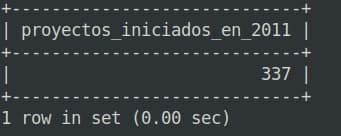

## CONSULTA 2:
¿Cuál es el proyecto de mayor duración?

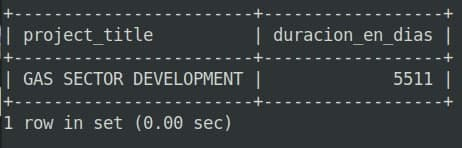

## CONSULTA 3:
¿Cuál es el proyecto de menor duración?

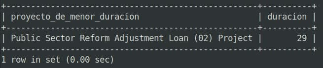

## CONSULTA 4:
Top 5 paises con mas proyectos asignados

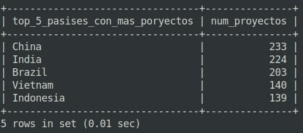

## CONSULTA 5:
Top 5 paises con menos proyectos asignados

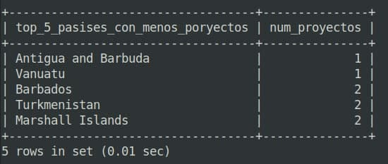

## CONSULTA 6:
¿Cuál fue el proyecto mas costoso?

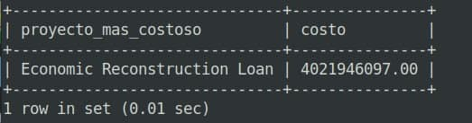

## CONSULTA 7:
¿Cuál fue el proyecto menos costoso?

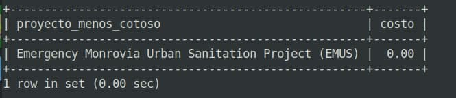

## CONSULTA 8:
Top 5 de proyectos más costos

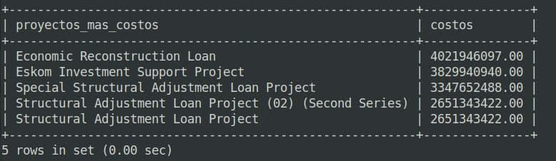

## CONSULTA 9:
Costo total de todos los proyectos

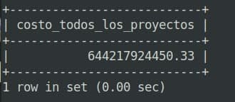

## CONSULTA 10:
Top 3 de las Transacciones mas costas de RI-East Africa Public Health Laboratory Networking Project

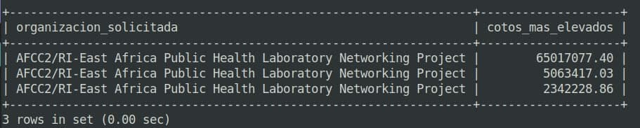

## MODELO RELACIONAL:
Hecho con oracle data modeler

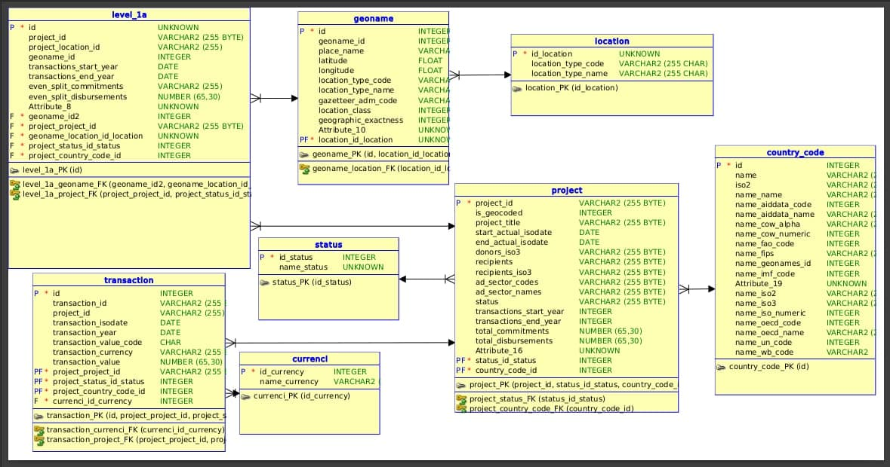
